# ArxPrism 架构与核心能力 — Mermaid 图集（细化版）

本文档用 Mermaid 描述 **用户视角页面动线**、部署、组件、**Redis 键空间**、**任务/论文状态机**、**抓取与双道门禁**、**单篇处理全链路**、**Neo4j 与向量检索**、**鉴权与配额**、**管理端 API** 等。与当前代码一致；实现变更时请同步改本文档。

渲染：GitHub、VS Code（Mermaid 插件）、Notion、语雀等均可识别 ` ```mermaid ` 代码块。

### 整体配色（`theme: base` + `themeVariables`）

上一版偏 **浅天蓝 + 浅灰线**，在白底上对比度偏低；后一度把 **子图填成 stone-300 整块灰**，分组清晰但显得「脏」。现改为 **子图与画布同白**，仅靠 **stone-400 描边**圈出分组；节点仍为浅 stone-50 填充 + 深字深线，阅读不累。

| 用途 | 色值 | 说明 |
|------|------|------|
| 画布 `mainBkg` | `#ffffff` | 纯白底 |
| 子图 `clusterBkg` / `clusterBorder` | `#ffffff` / `#a8a29e` | **无底灰块**：与白底一体，**只留边框**区分 subgraph |
| 节点填充 `primaryColor` | `#fafaf9` | stone-50，略暖、不晃眼 |
| 节点字 / 边框 | `#1c1917` / `#44403c` | stone-900 字 + stone-700 框，**高可读** |
| 连线 `lineColor` / `defaultLinkColor` | `#27272a` | zinc-800，箭头清晰 |
| 边标签底 `edgeLabelBackground` | `#ffffff` | 白底贴字，避免浅蓝字漂在浅底上 |
| 字号 `fontSize` | `16px` | 略放大，减轻眯眼 |
| 时序图参与者 | 与节点同 stone 系 | 深框深字 |
| 便签 `note*` | `#fef9c3` / `#a16207` | 柔和黄备注，对比足够 |

新增图时请复制任一图中首行 `%%{init: ...}%%`。

---

## 用户视角动线（页面旅程）

从**使用者眼睛**出发：先登录进门，再可选「跑任务把论文写入图库」或「直接浏览已入库」；论文详情是**图谱 / 进化树**的常见入口。与 `middleware.ts` 保护范围、`Navbar` 导航一致。

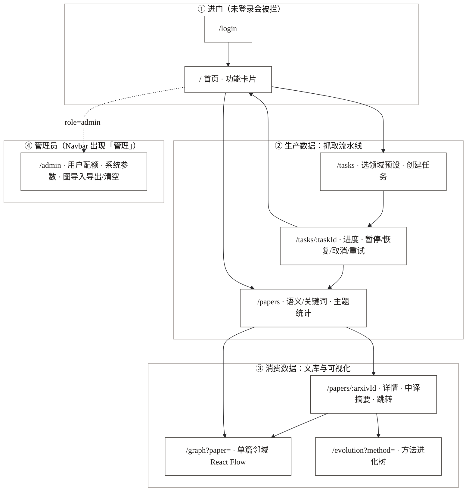
```mermaid
%%{init: {'theme':'base','themeVariables':{'fontFamily':'ui-sans-serif,system-ui,sans-serif','fontSize':'16px','primaryColor':'#fafaf9','primaryTextColor':'#1c1917','primaryBorderColor':'#44403c','secondaryColor':'#f5f5f4','tertiaryColor':'#e7e5e4','lineColor':'#27272a','secondaryTextColor':'#1c1917','tertiaryTextColor':'#292524','mainBkg':'#ffffff','textColor':'#1c1917','nodeBorder':'#44403c','defaultLinkColor':'#27272a','clusterBkg':'#ffffff','clusterBorder':'#a8a29e','edgeLabelBackground':'#ffffff','titleColor':'#0c0a09','actorBkg':'#fafaf9','actorBorder':'#44403c','actorTextColor':'#1c1917','signalColor':'#27272a','signalTextColor':'#1c1917','activationBkgColor':'#e7e5e4','activationBorderColor':'#57534e','noteBkgColor':'#fef9c3','noteTextColor':'#422006','noteBorderColor':'#a16207'}}}%%
flowchart TB
    subgraph P1["① 进门（未登录会被拦）"]
        LG["/login"]
        HM["/ 首页 · 功能卡片"]
        LG --> HM
    end

    subgraph P2["② 生产数据：抓取流水线"]
        TS["/tasks · 选领域预设 · 创建任务"]
        TD["/tasks/:taskId · 进度 · 暂停/恢复/取消/重试"]
        TS --> TD
        TD --> HM
        TD --> PL
    end

    subgraph P3["③ 消费数据：文库与可视化"]
        PL["/papers · 语义/关键词 · 主题统计"]
        PD["/papers/:arxivId · 详情 · 中译摘要 · 跳转"]
        GR["/graph?paper= · 单篇邻域 React Flow"]
        EV["/evolution?method= · 方法进化树"]
        PL --> PD
        PD --> GR
        PD --> EV
        PL --> GR
    end

    subgraph P4["④ 管理员（Navbar 出现「管理」）"]
        AD["/admin · 用户配额 · 系统参数 · 图导入导出/清空"]
    end

    HM --> TS
    HM --> PL
    HM -.->|role=admin| AD
```

**说明**

- **首页**可同时去「任务」或「论文」；任务跑完后用户常从 **任务详情** 回到首页或直达 **论文列表**（图中 `TD --> PL` 表示「去看入库结果」的典型路径）。
- **论文详情**内可点进 **图谱**（同一篇 arXiv）或 **进化树**（依赖 `proposed_method_name_key` / 方法名）。
- **`/admin`** 不在公共导航里自动出现；需 `profiles.role = admin`（见 `meApi.getMe` + `Navbar`）。

---

## 1. 系统上下文（C4 Context，带数据面标注）

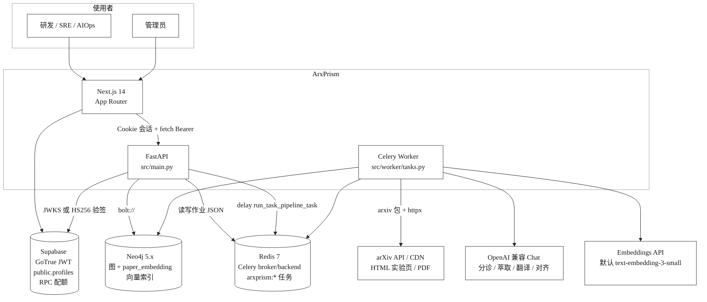
```mermaid
%%{init: {'theme':'base','themeVariables':{'fontFamily':'ui-sans-serif,system-ui,sans-serif','fontSize':'16px','primaryColor':'#fafaf9','primaryTextColor':'#1c1917','primaryBorderColor':'#44403c','secondaryColor':'#f5f5f4','tertiaryColor':'#e7e5e4','lineColor':'#27272a','secondaryTextColor':'#1c1917','tertiaryTextColor':'#292524','mainBkg':'#ffffff','textColor':'#1c1917','nodeBorder':'#44403c','defaultLinkColor':'#27272a','clusterBkg':'#ffffff','clusterBorder':'#a8a29e','edgeLabelBackground':'#ffffff','titleColor':'#0c0a09','actorBkg':'#fafaf9','actorBorder':'#44403c','actorTextColor':'#1c1917','signalColor':'#27272a','signalTextColor':'#1c1917','activationBkgColor':'#e7e5e4','activationBorderColor':'#57534e','noteBkgColor':'#fef9c3','noteTextColor':'#422006','noteBorderColor':'#a16207'}}}%%
flowchart TB
    subgraph Users["使用者"]
        U1["研发 / SRE / AIOps"]
        U2["管理员"]
    end

    subgraph ArxPrism["ArxPrism"]
        FE["Next.js 14\nApp Router"]
        API["FastAPI\nsrc/main.py"]
        WK["Celery Worker\nsrc/worker/tasks.py"]
    end

    SB[("Supabase\nGoTrue JWT\npublic.profiles\nRPC 配额")]
    N4j[("Neo4j 5.x\n图 + paper_embedding\n向量索引")]
    RD[("Redis 7\nCelery broker/backend\narxprism:* 任务")]
    AX["arXiv API / CDN\nHTML 实验页 / PDF"]
    LLM["OpenAI 兼容 Chat\n分诊 / 萃取 / 翻译 / 对齐"]
    EMB["Embeddings API\n默认 text-embedding-3-small"]

    U1 --> FE
    U2 --> FE
    FE -->|"Cookie 会话 + fetch Bearer"| API
    FE --> SB
    API -->|"JWKS 或 HS256 验签"| SB
    API -->|"bolt://"| N4j
    API -->|"读写作业 JSON"| RD
    API -->|"delay run_task_pipeline_task"| RD
    WK --> RD
    WK -->|"arxiv 包 + httpx"| AX
    WK --> LLM
    WK --> EMB
    WK --> N4j
```


---

## 2. 部署拓扑（Docker Compose + 运维参数）

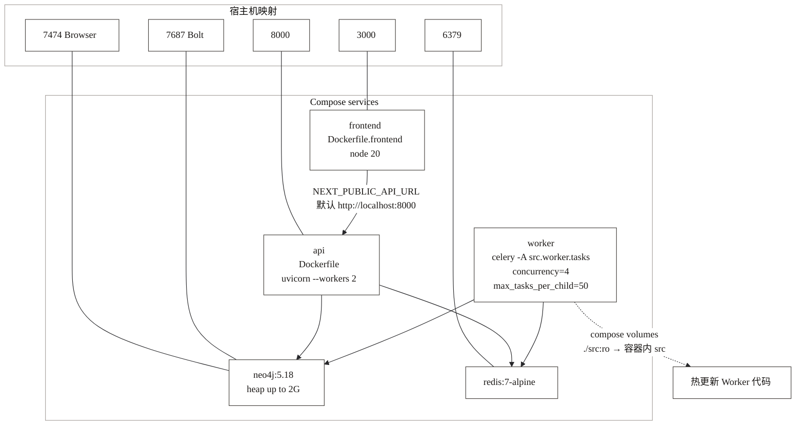
```mermaid
%%{init: {'theme':'base','themeVariables':{'fontFamily':'ui-sans-serif,system-ui,sans-serif','fontSize':'16px','primaryColor':'#fafaf9','primaryTextColor':'#1c1917','primaryBorderColor':'#44403c','secondaryColor':'#f5f5f4','tertiaryColor':'#e7e5e4','lineColor':'#27272a','secondaryTextColor':'#1c1917','tertiaryTextColor':'#292524','mainBkg':'#ffffff','textColor':'#1c1917','nodeBorder':'#44403c','defaultLinkColor':'#27272a','clusterBkg':'#ffffff','clusterBorder':'#a8a29e','edgeLabelBackground':'#ffffff','titleColor':'#0c0a09','actorBkg':'#fafaf9','actorBorder':'#44403c','actorTextColor':'#1c1917','signalColor':'#27272a','signalTextColor':'#1c1917','activationBkgColor':'#e7e5e4','activationBorderColor':'#57534e','noteBkgColor':'#fef9c3','noteTextColor':'#422006','noteBorderColor':'#a16207'}}}%%
flowchart TB
    subgraph Svc["Compose services"]
        FE["frontend\nDockerfile.frontend\nnode 20"]
        API["api\nDockerfile\nuvicorn --workers 2"]
        WK["worker\ncelery -A src.worker.tasks\nconcurrency=4\nmax_tasks_per_child=50"]
        N4j["neo4j:5.18\nheap up to 2G"]
        RD["redis:7-alpine"]
    end

    subgraph Ports["宿主机映射"]
        P3000["3000"]
        P8000["8000"]
        P7474["7474 Browser"]
        P7687["7687 Bolt"]
        P6379["6379"]
    end

    P3000 --- FE
    P8000 --- API
    P7474 --- N4j
    P7687 --- N4j
    P6379 --- RD

    API --> N4j
    API --> RD
    WK --> N4j
    WK --> RD
    FE -->|"NEXT_PUBLIC_API_URL\n默认 http://localhost:8000"| API
    WK -.->|"compose volumes\n./src:ro → 容器内 src"| DEVVOL["热更新 Worker 代码"]
```


---

## 3. 后端分层（文件级依赖）

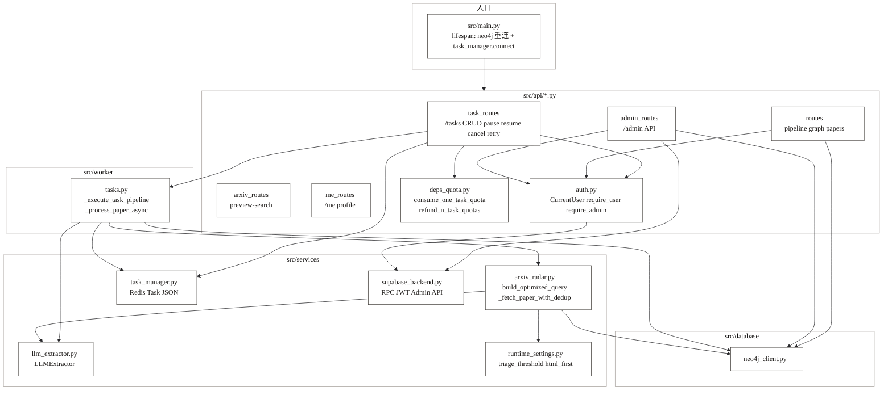
```mermaid
%%{init: {'theme':'base','themeVariables':{'fontFamily':'ui-sans-serif,system-ui,sans-serif','fontSize':'16px','primaryColor':'#fafaf9','primaryTextColor':'#1c1917','primaryBorderColor':'#44403c','secondaryColor':'#f5f5f4','tertiaryColor':'#e7e5e4','lineColor':'#27272a','secondaryTextColor':'#1c1917','tertiaryTextColor':'#292524','mainBkg':'#ffffff','textColor':'#1c1917','nodeBorder':'#44403c','defaultLinkColor':'#27272a','clusterBkg':'#ffffff','clusterBorder':'#a8a29e','edgeLabelBackground':'#ffffff','titleColor':'#0c0a09','actorBkg':'#fafaf9','actorBorder':'#44403c','actorTextColor':'#1c1917','signalColor':'#27272a','signalTextColor':'#1c1917','activationBkgColor':'#e7e5e4','activationBorderColor':'#57534e','noteBkgColor':'#fef9c3','noteTextColor':'#422006','noteBorderColor':'#a16207'}}}%%
flowchart TB
    subgraph Entry["入口"]
        MAIN["src/main.py\nlifespan: neo4j 重连 + task_manager.connect"]
    end

    subgraph Routers["src/api/*.py"]
        TR["task_routes\n/tasks CRUD pause resume cancel retry"]
        RR["routes\npipeline graph papers"]
        AR["arxiv_routes\npreview-search"]
        ME["me_routes\n/me profile"]
        AD["admin_routes\n/admin API"]
        AUTH["auth.py\nCurrentUser require_user require_admin"]
        DQ["deps_quota.py\nconsume_one_task_quota\nrefund_n_task_quotas"]
    end

    subgraph Svc["src/services"]
        RAD["arxiv_radar.py\nbuild_optimized_query\n_fetch_paper_with_dedup"]
        LLM["llm_extractor.py\nLLMExtractor"]
        TM["task_manager.py\nRedis Task JSON"]
        RUN["runtime_settings.py\ntriage_threshold html_first"]
        SBK["supabase_backend.py\nRPC JWT Admin API"]
    end

    subgraph DB["src/database"]
        NC["neo4j_client.py"]
    end

    subgraph Worker["src/worker"]
        TSK["tasks.py\n_execute_task_pipeline\n_process_paper_async"]
    end

    MAIN --> Routers
    TR --> AUTH
    TR --> DQ
    TR --> TM
    TR --> TSK
    RR --> AUTH
    RR --> NC
    AD --> AUTH
    AD --> NC
    AD --> SBK
    AUTH --> SBK
    TSK --> RAD
    TSK --> LLM
    TSK --> NC
    TSK --> TM
    RAD --> RUN
    RAD --> LLM
    RAD --> NC
```


---

## 4. Redis 键空间（任务与 Celery）

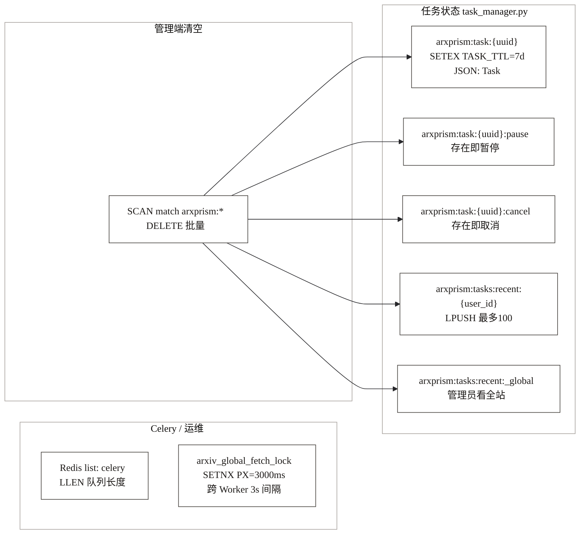
```mermaid
%%{init: {'theme':'base','themeVariables':{'fontFamily':'ui-sans-serif,system-ui,sans-serif','fontSize':'16px','primaryColor':'#fafaf9','primaryTextColor':'#1c1917','primaryBorderColor':'#44403c','secondaryColor':'#f5f5f4','tertiaryColor':'#e7e5e4','lineColor':'#27272a','secondaryTextColor':'#1c1917','tertiaryTextColor':'#292524','mainBkg':'#ffffff','textColor':'#1c1917','nodeBorder':'#44403c','defaultLinkColor':'#27272a','clusterBkg':'#ffffff','clusterBorder':'#a8a29e','edgeLabelBackground':'#ffffff','titleColor':'#0c0a09','actorBkg':'#fafaf9','actorBorder':'#44403c','actorTextColor':'#1c1917','signalColor':'#27272a','signalTextColor':'#1c1917','activationBkgColor':'#e7e5e4','activationBorderColor':'#57534e','noteBkgColor':'#fef9c3','noteTextColor':'#422006','noteBorderColor':'#a16207'}}}%%
flowchart LR
    subgraph TaskKeys["任务状态 task_manager.py"]
        K1["arxprism:task:{uuid}\nSETEX TASK_TTL=7d\nJSON: Task"]
        K2["arxprism:task:{uuid}:pause\n存在即暂停"]
        K3["arxprism:task:{uuid}:cancel\n存在即取消"]
        K4["arxprism:tasks:recent:{user_id}\nLPUSH 最多100"]
        K5["arxprism:tasks:recent:_global\n管理员看全站"]
    end

    subgraph Broker["Celery / 运维"]
        Q["Redis list: celery\nLLEN 队列长度"]
        ARX["arxiv_global_fetch_lock\nSETNX PX=3000ms\n跨 Worker 3s 间隔"]
    end

    subgraph Wipe["管理端清空"]
        W["SCAN match arxprism:*\nDELETE 批量"]
    end

    W --> K1
    W --> K2
    W --> K3
    W --> K4
    W --> K5
```


---

## 5. 任务状态机（TaskStatus）

`stateDiagram-v2` 自动排版易把 **pause/resume**、**retry** 与 **cancel** 的边叠在一起。下面用 `**flowchart TB` 手工主轴 + 挂起侧枝**，语义与 `TaskStatus` 枚举及 `task_manager` 行为一致。

**触发说明**

- **启动**：`POST` 创建任务后 Worker 执行 `_execute_task_pipeline` → `start_task` → `running`。
- **pause / resume / cancel**：`POST /api/v1/tasks/{id}/pause|resume|cancel`；cancel 还会在 Redis 写入 `arxprism:task:{id}:cancel`，Worker 循环内检测后中止。
- **retry**：仅当状态为 `failed` 时 `POST .../retry`，回到 `pending` 并再次 dispatch。
- **completed**：全部论文处理完或「0 篇可处理」等正常收尾；**failed** 为未捕获异常。

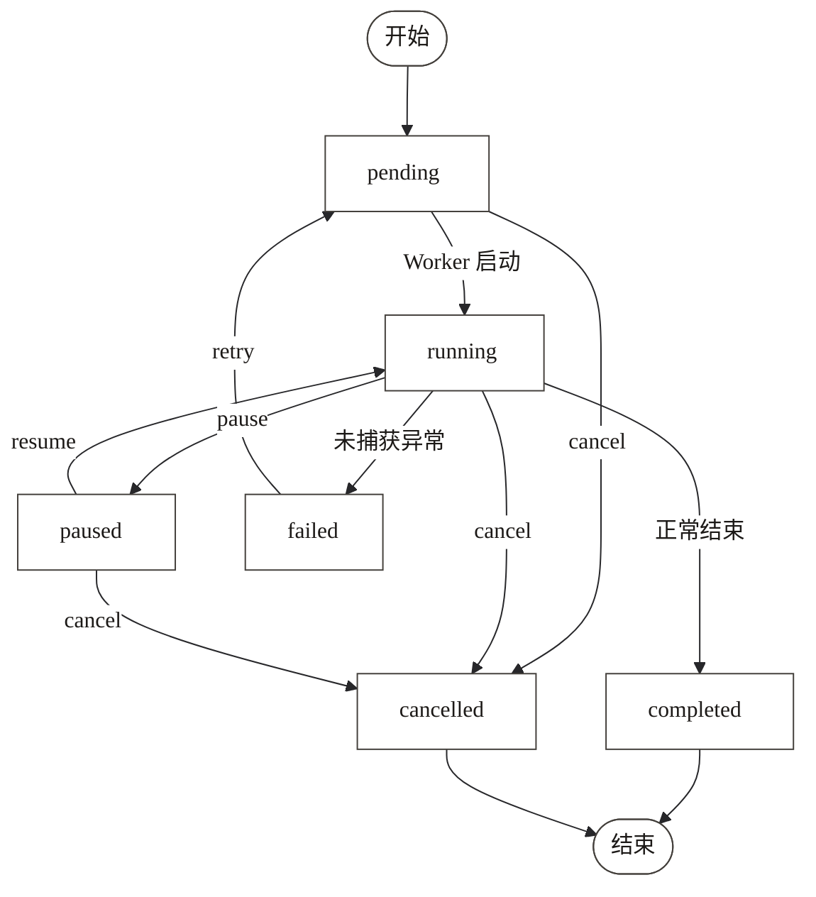
```mermaid
%%{init: {'theme':'base','themeVariables':{'fontFamily':'ui-sans-serif,system-ui,sans-serif','fontSize':'16px','primaryColor':'#fafaf9','primaryTextColor':'#1c1917','primaryBorderColor':'#44403c','secondaryColor':'#f5f5f4','tertiaryColor':'#e7e5e4','lineColor':'#27272a','secondaryTextColor':'#1c1917','tertiaryTextColor':'#292524','mainBkg':'#ffffff','textColor':'#1c1917','nodeBorder':'#44403c','defaultLinkColor':'#27272a','clusterBkg':'#ffffff','clusterBorder':'#a8a29e','edgeLabelBackground':'#ffffff','titleColor':'#0c0a09','actorBkg':'#fafaf9','actorBorder':'#44403c','actorTextColor':'#1c1917','signalColor':'#27272a','signalTextColor':'#1c1917','activationBkgColor':'#e7e5e4','activationBorderColor':'#57534e','noteBkgColor':'#fef9c3','noteTextColor':'#422006','noteBorderColor':'#a16207'}}}%%
flowchart TB
    IN([开始]) --> P[pending]

    P -->|Worker 启动| R[running]
    R -->|正常结束| C[completed]
    C --> OUT([结束])

    R -->|pause| U[paused]
    U -->|resume| R

    R -->|未捕获异常| F[failed]
    F -->|retry| P

    P -->|cancel| X[cancelled]
    R -->|cancel| X
    U -->|cancel| X
    X --> OUT
```


**转移一览（与上图一一对应）**


| #   | 源状态                        | 条件 / API                                | 目标状态      |
| --- | -------------------------- | --------------------------------------- | --------- |
| 1   | —                          | 创建任务                                    | pending   |
| 2   | pending                    | Worker `start_task`                     | running   |
| 3   | running                    | `complete_task`（遍历结束或 0 篇说明）            | completed |
| 4   | running                    | `POST .../pause`                        | paused    |
| 5   | paused                     | `POST .../resume`                       | running   |
| 6   | running                    | 未捕获异常 `fail_task`                       | failed    |
| 7   | failed                     | `POST .../retry`                        | pending   |
| 8   | pending / running / paused | `POST .../cancel` 或 Worker 检测到 cancel 键 | cancelled |


**与代码对齐**：`src/models/task_models.py` 中 `TaskStatus`；`can_pause` / `can_resume` / `can_cancel` / `can_retry` 属性。

---

## 6. 单篇论文处理状态（PaperProcessingStatus）

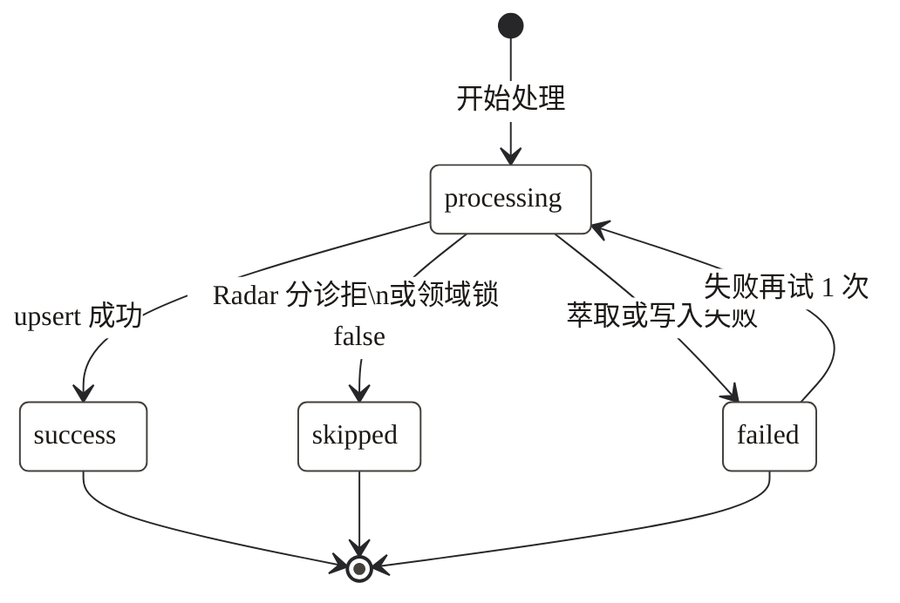
```mermaid
%%{init: {'theme':'base','themeVariables':{'fontFamily':'ui-sans-serif,system-ui,sans-serif','fontSize':'16px','primaryColor':'#fafaf9','primaryTextColor':'#1c1917','primaryBorderColor':'#44403c','secondaryColor':'#f5f5f4','tertiaryColor':'#e7e5e4','lineColor':'#27272a','secondaryTextColor':'#1c1917','tertiaryTextColor':'#292524','mainBkg':'#ffffff','textColor':'#1c1917','nodeBorder':'#44403c','defaultLinkColor':'#27272a','clusterBkg':'#ffffff','clusterBorder':'#a8a29e','edgeLabelBackground':'#ffffff','titleColor':'#0c0a09','actorBkg':'#fafaf9','actorBorder':'#44403c','actorTextColor':'#1c1917','signalColor':'#27272a','signalTextColor':'#1c1917','activationBkgColor':'#e7e5e4','activationBorderColor':'#57534e','noteBkgColor':'#fef9c3','noteTextColor':'#422006','noteBorderColor':'#a16207'}}}%%
stateDiagram-v2
    [*] --> processing: 开始处理
    processing --> skipped: Radar 分诊拒\n或领域锁 false
    processing --> failed: 萃取或写入失败
    processing --> success: upsert 成功
    failed --> processing: 失败再试 1 次
    success --> [*]
    skipped --> [*]
    failed --> [*]
```


说明：仅 `FAILED` 会由 `_process_paper_with_one_retry_on_failure` 再跑一轮；`SKIPPED` 不重试。

---

## 7. arXiv 抓取子流水线（Radar 内部）

在 `**fetch_recent_papers_with_stats**` 的扫描循环中，对每篇候选 arXiv `Result`：

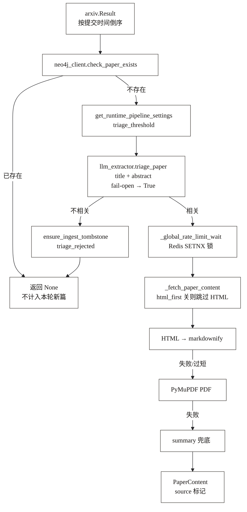
```mermaid
%%{init: {'theme':'base','themeVariables':{'fontFamily':'ui-sans-serif,system-ui,sans-serif','fontSize':'16px','primaryColor':'#fafaf9','primaryTextColor':'#1c1917','primaryBorderColor':'#44403c','secondaryColor':'#f5f5f4','tertiaryColor':'#e7e5e4','lineColor':'#27272a','secondaryTextColor':'#1c1917','tertiaryTextColor':'#292524','mainBkg':'#ffffff','textColor':'#1c1917','nodeBorder':'#44403c','defaultLinkColor':'#27272a','clusterBkg':'#ffffff','clusterBorder':'#a8a29e','edgeLabelBackground':'#ffffff','titleColor':'#0c0a09','actorBkg':'#fafaf9','actorBorder':'#44403c','actorTextColor':'#1c1917','signalColor':'#27272a','signalTextColor':'#1c1917','activationBkgColor':'#e7e5e4','activationBorderColor':'#57534e','noteBkgColor':'#fef9c3','noteTextColor':'#422006','noteBorderColor':'#a16207'}}}%%
flowchart TD
    A["arxiv.Result\n按提交时间倒序"] --> B["neo4j_client.check_paper_exists"]
    B -->|已存在| Z["返回 None\n不计入本轮新篇"]
    B -->|不存在| C["get_runtime_pipeline_settings\ntriage_threshold"]
    C --> D["llm_extractor.triage_paper\ntitle + abstract\nfail-open → True"]
    D -->|不相关| T1["ensure_ingest_tombstone\ntriage_rejected"]
    T1 --> Z
    D -->|相关| E["_global_rate_limit_wait\nRedis SETNX 锁"]
    E --> F["_fetch_paper_content\nhtml_first 关则跳过 HTML"]
    F --> G["HTML → markdownify"]
    G -->|失败/过短| H["PyMuPDF PDF"]
    H -->|失败| I["summary 兜底"]
    I --> J["PaperContent\nsource 标记"]
```


**查询构建**：`build_optimized_query(user_query, domain_preset)` — 用户 `all:"..."` 与预设类目分支 **OR** 合并，再套 `ANDNOT` 排除词；`custom` 预设原样返回用户字符串。

---

## 8. 任务主循环 + 单篇萃取（与时序对照）

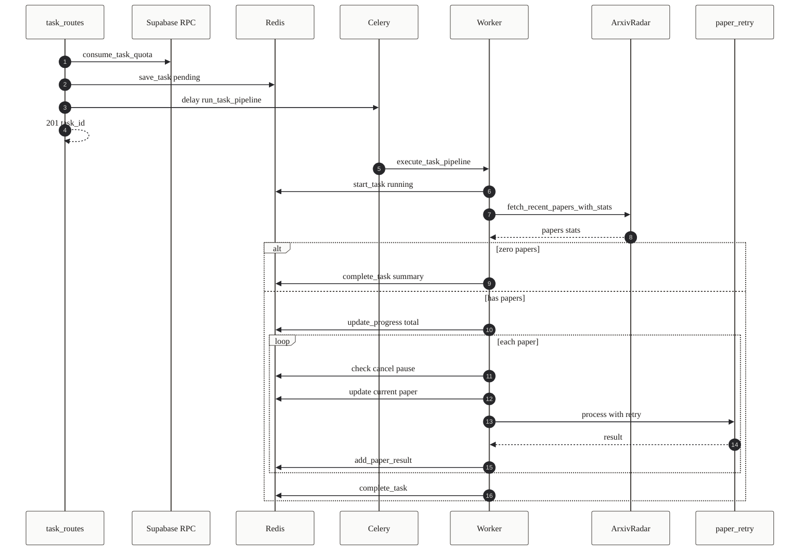
```mermaid
%%{init: {'theme':'base','themeVariables':{'fontFamily':'ui-sans-serif,system-ui,sans-serif','fontSize':'16px','primaryColor':'#fafaf9','primaryTextColor':'#1c1917','primaryBorderColor':'#44403c','secondaryColor':'#f5f5f4','tertiaryColor':'#e7e5e4','lineColor':'#27272a','secondaryTextColor':'#1c1917','tertiaryTextColor':'#292524','mainBkg':'#ffffff','textColor':'#1c1917','nodeBorder':'#44403c','defaultLinkColor':'#27272a','clusterBkg':'#ffffff','clusterBorder':'#a8a29e','edgeLabelBackground':'#ffffff','titleColor':'#0c0a09','actorBkg':'#fafaf9','actorBorder':'#44403c','actorTextColor':'#1c1917','signalColor':'#27272a','signalTextColor':'#1c1917','activationBkgColor':'#e7e5e4','activationBorderColor':'#57534e','noteBkgColor':'#fef9c3','noteTextColor':'#422006','noteBorderColor':'#a16207'}}}%%
sequenceDiagram
    autonumber
    participant API as task_routes
    participant SB as Supabase RPC
    participant RD as Redis
    participant CE as Celery
    participant WK as Worker
    participant RAD as ArxivRadar
    participant PP as paper_retry

    API->>SB: consume_task_quota
    API->>RD: save_task pending
    API->>CE: delay run_task_pipeline
    API-->>API: 201 task_id

    CE->>WK: execute_task_pipeline
    WK->>RD: start_task running
    WK->>RAD: fetch_recent_papers_with_stats
    RAD-->>WK: papers stats

    alt zero papers
        WK->>RD: complete_task summary
    else has papers
        WK->>RD: update_progress total
        loop each paper
            WK->>RD: check cancel pause
            WK->>RD: update current paper
            WK->>PP: process with retry
            PP-->>WK: result
            WK->>RD: add_paper_result
        end
        WK->>RD: complete_task
    end
```


---

## 9. 单篇 `_process_paper_async` 详解（Worker）

Mermaid 的 `sequenceDiagram` **不宜**在 `alt` 内再套 `opt`，故拆成单层分支；与代码路径一致。

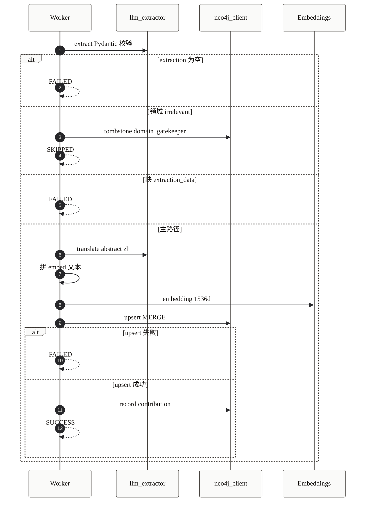
```mermaid
%%{init: {'theme':'base','themeVariables':{'fontFamily':'ui-sans-serif,system-ui,sans-serif','fontSize':'16px','primaryColor':'#fafaf9','primaryTextColor':'#1c1917','primaryBorderColor':'#44403c','secondaryColor':'#f5f5f4','tertiaryColor':'#e7e5e4','lineColor':'#27272a','secondaryTextColor':'#1c1917','tertiaryTextColor':'#292524','mainBkg':'#ffffff','textColor':'#1c1917','nodeBorder':'#44403c','defaultLinkColor':'#27272a','clusterBkg':'#ffffff','clusterBorder':'#a8a29e','edgeLabelBackground':'#ffffff','titleColor':'#0c0a09','actorBkg':'#fafaf9','actorBorder':'#44403c','actorTextColor':'#1c1917','signalColor':'#27272a','signalTextColor':'#1c1917','activationBkgColor':'#e7e5e4','activationBorderColor':'#57534e','noteBkgColor':'#fef9c3','noteTextColor':'#422006','noteBorderColor':'#a16207'}}}%%
sequenceDiagram
    autonumber
    participant W as Worker
    participant L as llm_extractor
    participant N as neo4j_client
    participant E as Embeddings

    W->>L: extract Pydantic 校验
    alt extraction 为空
        W-->>W: FAILED
    else 领域 irrelevant
        W->>N: tombstone domain_gatekeeper
        W-->>W: SKIPPED
    else 缺 extraction_data
        W-->>W: FAILED
    else 主路径
        W->>L: translate abstract zh
        W->>W: 拼 embed 文本
        W->>E: embedding 1536d
        W->>N: upsert MERGE
        alt upsert 失败
            W-->>W: FAILED
        else upsert 成功
            W->>N: record contribution
            W-->>W: SUCCESS
        end
    end
```


函数级细节：`extract` 使用 `llm_extractor_model`、`response_format=json_object`；`embedding` 仅当 `len(vec)==1536` 写入；`record_paper_fetch_contribution` 仅在 `owner_user_id` 与 `task_id` 非空时调用。

**注意**：**分诊**在 Radar 下载全文**之前**；**领域锁**在萃取 JSON 内再次约束。两者语义不同：前者省下载与 Token，后者防全文萃取阶段模型误判。

---

## 10. Neo4j 图模型（关系 + 关键属性）

> **读图顺序**：先看「图 1」论文与周边实体；再看「图 2」**仅描述 Method 之间的两类有向边**（避免与图 1 的线缠在一起）。**箭头方向**与 Cypher `MERGE (a)-[r:TYPE]->(b)` 一致。

### 图 1 — 以 `Paper` 为中心的入库子图（`upsert_paper_graph`）

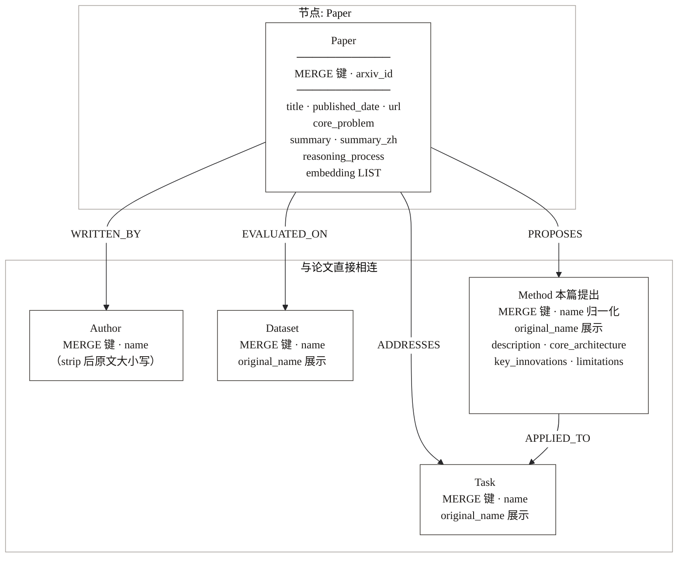
```mermaid
%%{init: {'theme':'base','themeVariables':{'fontFamily':'ui-sans-serif,system-ui,sans-serif','fontSize':'16px','primaryColor':'#fafaf9','primaryTextColor':'#1c1917','primaryBorderColor':'#44403c','secondaryColor':'#f5f5f4','tertiaryColor':'#e7e5e4','lineColor':'#27272a','secondaryTextColor':'#1c1917','tertiaryTextColor':'#292524','mainBkg':'#ffffff','textColor':'#1c1917','nodeBorder':'#44403c','defaultLinkColor':'#27272a','clusterBkg':'#ffffff','clusterBorder':'#a8a29e','edgeLabelBackground':'#ffffff','titleColor':'#0c0a09','actorBkg':'#fafaf9','actorBorder':'#44403c','actorTextColor':'#1c1917','signalColor':'#27272a','signalTextColor':'#1c1917','activationBkgColor':'#e7e5e4','activationBorderColor':'#57534e','noteBkgColor':'#fef9c3','noteTextColor':'#422006','noteBorderColor':'#a16207'}}}%%
flowchart TB
    subgraph Pnode["节点: Paper"]
        P["Paper\n────────────\nMERGE 键 · arxiv_id\n────────────\ntitle · published_date · url\ncore_problem\nsummary · summary_zh\nreasoning_process\nembedding LIST"]
    end

    subgraph Ring["与论文直接相连"]
        A["Author\nMERGE 键 · name\n（strip 后原文大小写）"]
        T["Task\nMERGE 键 · name\noriginal_name 展示"]
        D["Dataset\nMERGE 键 · name\noriginal_name 展示"]
        Mp["Method 本篇提出\nMERGE 键 · name 归一化\noriginal_name 展示\ndescription · core_architecture\nkey_innovations · limitations"]
    end

    P -->|WRITTEN_BY| A
    P -->|ADDRESSES| T
    P -->|PROPOSES| Mp
    P -->|EVALUATED_ON| D
    Mp -->|APPLIED_TO| T
```

说明：

- **`EVALUATED_ON → Dataset`**：在 `comparisons` 里**带非空 dataset** 时写入；同一篇可连多个 Dataset。
- **`MEASURES → Metric`**：图模型仍保留该关系类型（读库/导入/历史数据可见）；**当前 v2 萃取主路径**把实验指标写在 **`IMPROVES_UPON` 边属性**上，见下图与边属性表。

### 图 2 — `Method` 之间：技术血脉 vs 实验对比（切勿画进图 1 混线）

**`MP` 与图 1 中「Method 本篇提出」为同一节点**（同一 `name` 归一化键，此处只画两条出边以免与论文辐射边交叉）。

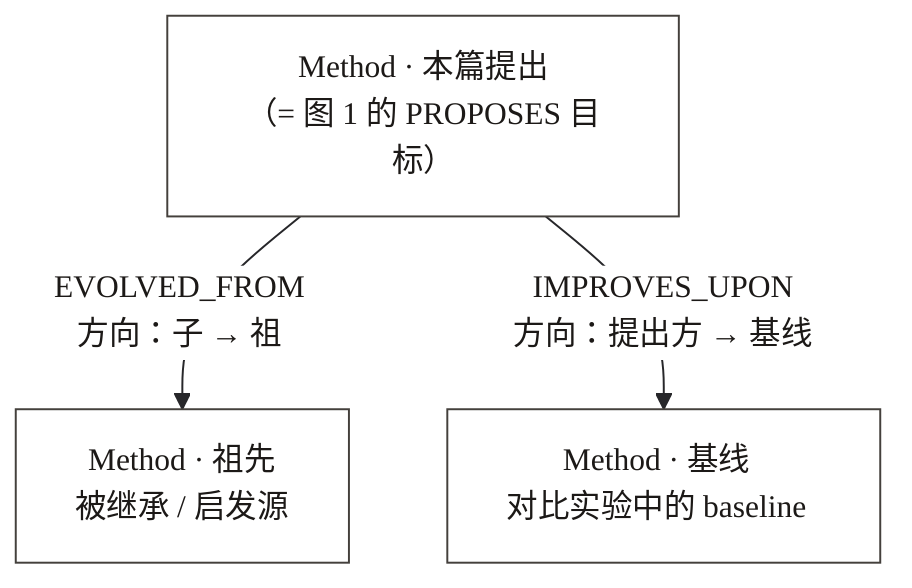
```mermaid
%%{init: {'theme':'base','themeVariables':{'fontFamily':'ui-sans-serif,system-ui,sans-serif','fontSize':'16px','primaryColor':'#fafaf9','primaryTextColor':'#1c1917','primaryBorderColor':'#44403c','secondaryColor':'#f5f5f4','tertiaryColor':'#e7e5e4','lineColor':'#27272a','secondaryTextColor':'#1c1917','tertiaryTextColor':'#292524','mainBkg':'#ffffff','textColor':'#1c1917','nodeBorder':'#44403c','defaultLinkColor':'#27272a','clusterBkg':'#ffffff','clusterBorder':'#a8a29e','edgeLabelBackground':'#ffffff','titleColor':'#0c0a09','actorBkg':'#fafaf9','actorBorder':'#44403c','actorTextColor':'#1c1917','signalColor':'#27272a','signalTextColor':'#1c1917','activationBkgColor':'#e7e5e4','activationBorderColor':'#57534e','noteBkgColor':'#fef9c3','noteTextColor':'#422006','noteBorderColor':'#a16207'}}}%%
flowchart TB
    MP["Method · 本篇提出\n（= 图 1 的 PROPOSES 目标）"]

    MA["Method · 祖先\n被继承 / 启发源"]
    MB["Method · 基线\n对比实验中的 baseline"]

    MP -->|"EVOLVED_FROM\n方向：子 → 祖"| MA
    MP -->|"IMPROVES_UPON\n方向：提出方 → 基线"| MB
```

**两类边的语义（必背）**

| 关系 | 方向 | JSON 来源 | 含义 |
|------|------|-----------|------|
| `EVOLVED_FROM` | **(子 Method) → (祖 Method)** | `evolution_lineages` | 本篇方法在思路上**建立在谁之上 / 受谁启发** |
| `IMPROVES_UPON` | **(提出方 Method) → (基线 Method)** | `comparisons` | 在实验上**相对某 baseline 的提升**（数据集与指标在边上） |

**边属性（与 `neo4j_client.upsert_paper_graph` 一致）**

| 关系 | 边上属性 |
|------|----------|
| `EVOLVED_FROM` | `reason`，`discovered_at`，`source_papers` |
| `IMPROVES_UPON` | `dataset`，`metrics_improvement`，`discovered_at`，`source_papers` |

`source_papers`：字符串列表，记录**哪些 arxiv_id 贡献过该条边**（重复入库时累加，非覆盖）。

### 节点 MERGE 键速查

| Label | MERGE 键 | 备注 |
|-------|----------|------|
| Paper | `arxiv_id` | |
| Author | `name` | |
| Task | `name` | 归一化；`original_name` 存展示 |
| Dataset | `name` | 归一化；`original_name` |
| Method | `name` | **归一化键**；`original_name` 与列表/进化树展示一致 |

### 写入契约

- **Pydantic**：`src/models/schemas.py` → `ExtractionData`、`KnowledgeGraphNodes`（`evolution_lineages`、`comparisons`）。
- **写入**：`src/database/neo4j_client.py` → `upsert_paper_graph`（**一律 `MERGE` + 参数化**；禁止裸 `CREATE` 防重复跑任务膨胀图）。

### 溯源补充（非萃取主图）

单篇成功入库且带 `owner_user_id` / `task_id` 时，可额外写入 **`Paper -[:FETCHED_BY]-> ContributorAccount`**（贡献者与 Redis 任务 ID），便于运营统计；与上图「知识结构」并列理解即可。

---

## 11. 进化树查询逻辑（Cypher 要点）

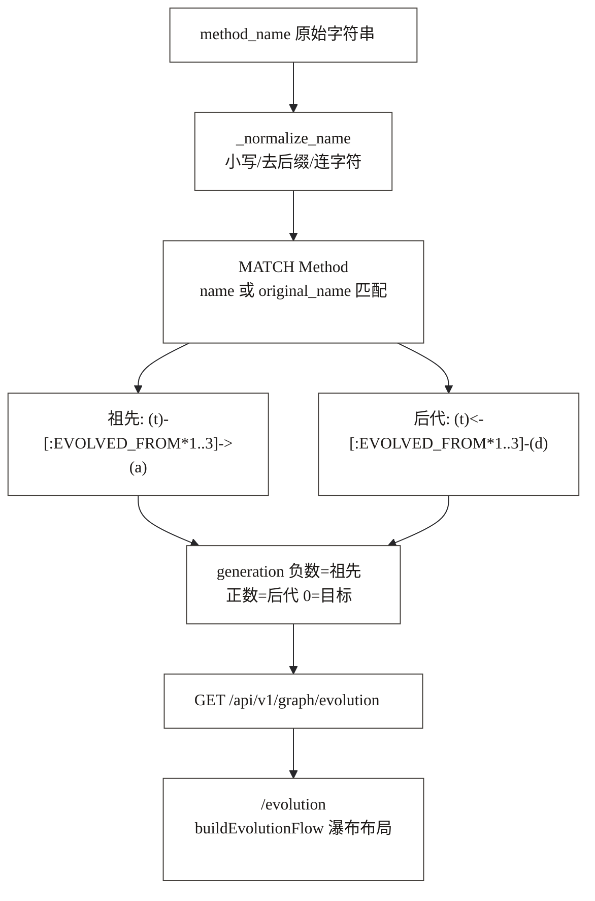
```mermaid
%%{init: {'theme':'base','themeVariables':{'fontFamily':'ui-sans-serif,system-ui,sans-serif','fontSize':'16px','primaryColor':'#fafaf9','primaryTextColor':'#1c1917','primaryBorderColor':'#44403c','secondaryColor':'#f5f5f4','tertiaryColor':'#e7e5e4','lineColor':'#27272a','secondaryTextColor':'#1c1917','tertiaryTextColor':'#292524','mainBkg':'#ffffff','textColor':'#1c1917','nodeBorder':'#44403c','defaultLinkColor':'#27272a','clusterBkg':'#ffffff','clusterBorder':'#a8a29e','edgeLabelBackground':'#ffffff','titleColor':'#0c0a09','actorBkg':'#fafaf9','actorBorder':'#44403c','actorTextColor':'#1c1917','signalColor':'#27272a','signalTextColor':'#1c1917','activationBkgColor':'#e7e5e4','activationBorderColor':'#57534e','noteBkgColor':'#fef9c3','noteTextColor':'#422006','noteBorderColor':'#a16207'}}}%%
flowchart TB
    IN["method_name 原始字符串"] --> NORM["_normalize_name\n小写/去后缀/连字符"]
    NORM --> MATCH["MATCH Method\nname 或 original_name 匹配"]
    MATCH --> ANC["祖先: (t)-[:EVOLVED_FROM*1..3]->(a)"]
    MATCH --> DESC["后代: (t)<-[:EVOLVED_FROM*1..3]-(d)"]
    ANC --> GEN["generation 负数=祖先\n正数=后代 0=目标"]
    DESC --> GEN
    GEN --> API["GET /api/v1/graph/evolution"]
    API --> FE["/evolution\nbuildEvolutionFlow 瀑布布局"]
```


扩展：`GET /graph/method/{name}/evolution?depth=1..5&direction=ancestors|descendants|both`。

---

## 12. 论文语义检索（向量 + 双阈值）

常量见 `**neo4j_client.py**`（与 `text-embedding-3-small` 1536 维一致）：


| 参数                       | 典型值               | 作用                      |
| ------------------------ | ----------------- | ----------------------- |
| 索引名                      | `paper_embedding` | Neo4j 向量索引              |
| `_VECTOR_MIN_SCORE`      | 0.42              | 绝对相似度下限，防「全库都像」         |
| `_VECTOR_RELATIVE_FLOOR` | 0.88              | 相对第一名比例，砍掉弱相关尾巴         |
| `_VECTOR_SCAN_CAP`       | 3000              | 单次向量查询扫描上限              |
| 查询向量缓存                   | TTL 300s，最多 256 条 | 重复 query 减 Embedding 调用 |



```mermaid
%%{init: {'theme':'base','themeVariables':{'fontFamily':'ui-sans-serif,system-ui,sans-serif','fontSize':'16px','primaryColor':'#fafaf9','primaryTextColor':'#1c1917','primaryBorderColor':'#44403c','secondaryColor':'#f5f5f4','tertiaryColor':'#e7e5e4','lineColor':'#27272a','secondaryTextColor':'#1c1917','tertiaryTextColor':'#292524','mainBkg':'#ffffff','textColor':'#1c1917','nodeBorder':'#44403c','defaultLinkColor':'#27272a','clusterBkg':'#ffffff','clusterBorder':'#a8a29e','edgeLabelBackground':'#ffffff','titleColor':'#0c0a09','actorBkg':'#fafaf9','actorBorder':'#44403c','actorTextColor':'#1c1917','signalColor':'#27272a','signalTextColor':'#1c1917','activationBkgColor':'#e7e5e4','activationBorderColor':'#57534e','noteBkgColor':'#fef9c3','noteTextColor':'#422006','noteBorderColor':'#a16207'}}}%%
flowchart LR
    Q["用户 query"] --> E["Embedding API"]
    E --> V["Neo4j vector\npaper_embedding"]
    V --> F["双阈值过滤\nmin_score 与相对顶分"]
    F --> R["papers 分页"]
```


关键词模式：`search_mode=keyword`，`title/core_problem/method CONTAINS`。

---

## 13. 鉴权路径（JWT 双栈 + 开发旁路）

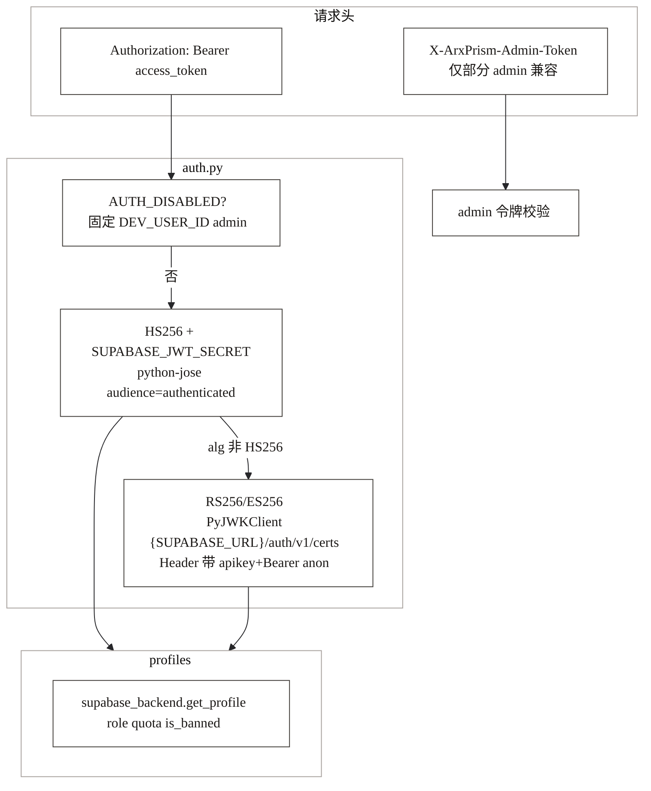
```mermaid
%%{init: {'theme':'base','themeVariables':{'fontFamily':'ui-sans-serif,system-ui,sans-serif','fontSize':'16px','primaryColor':'#fafaf9','primaryTextColor':'#1c1917','primaryBorderColor':'#44403c','secondaryColor':'#f5f5f4','tertiaryColor':'#e7e5e4','lineColor':'#27272a','secondaryTextColor':'#1c1917','tertiaryTextColor':'#292524','mainBkg':'#ffffff','textColor':'#1c1917','nodeBorder':'#44403c','defaultLinkColor':'#27272a','clusterBkg':'#ffffff','clusterBorder':'#a8a29e','edgeLabelBackground':'#ffffff','titleColor':'#0c0a09','actorBkg':'#fafaf9','actorBorder':'#44403c','actorTextColor':'#1c1917','signalColor':'#27272a','signalTextColor':'#1c1917','activationBkgColor':'#e7e5e4','activationBorderColor':'#57534e','noteBkgColor':'#fef9c3','noteTextColor':'#422006','noteBorderColor':'#a16207'}}}%%
flowchart TB
    subgraph Headers["请求头"]
        BA["Authorization: Bearer access_token"]
        AT["X-ArxPrism-Admin-Token\n仅部分 admin 兼容"]
    end

    subgraph Decode["auth.py"]
        AD["AUTH_DISABLED?\n固定 DEV_USER_ID admin"]
        HS["HS256 + SUPABASE_JWT_SECRET\npython-jose audience=authenticated"]
        JW["RS256/ES256\nPyJWKClient\n{SUPABASE_URL}/auth/v1/certs\nHeader 带 apikey+Bearer anon"]
    end

    subgraph Profile["profiles"]
        P["supabase_backend.get_profile\nrole quota is_banned"]
    end

    BA --> AD
    AD -->|否| HS
    HS -->|alg 非 HS256| JW
    HS --> Profile
    JW --> Profile
    AT --> ADMTOK["admin 令牌校验"]
```


---

## 14. Next.js 路由守卫与公开路径

`**middleware.ts**`：`createServerClient` 读 Cookie → `getUser()`；未登录且非公开路径 → `/login?next=`。

`**lib/authRoutes.ts**` `isPublicRoute`：

- `/` 首页
- `/login` 及子路径
- `/auth/*`（OAuth 回调等，避免破坏 PKCE）

其余如 `/papers`、`/tasks`、`/graph`、`/evolution`、`/admin` 均需会话。

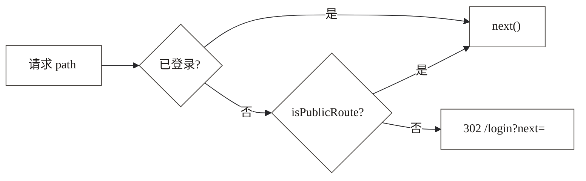
```mermaid
%%{init: {'theme':'base','themeVariables':{'fontFamily':'ui-sans-serif,system-ui,sans-serif','fontSize':'16px','primaryColor':'#fafaf9','primaryTextColor':'#1c1917','primaryBorderColor':'#44403c','secondaryColor':'#f5f5f4','tertiaryColor':'#e7e5e4','lineColor':'#27272a','secondaryTextColor':'#1c1917','tertiaryTextColor':'#292524','mainBkg':'#ffffff','textColor':'#1c1917','nodeBorder':'#44403c','defaultLinkColor':'#27272a','clusterBkg':'#ffffff','clusterBorder':'#a8a29e','edgeLabelBackground':'#ffffff','titleColor':'#0c0a09','actorBkg':'#fafaf9','actorBorder':'#44403c','actorTextColor':'#1c1917','signalColor':'#27272a','signalTextColor':'#1c1917','activationBkgColor':'#e7e5e4','activationBorderColor':'#57534e','noteBkgColor':'#fef9c3','noteTextColor':'#422006','noteBorderColor':'#a16207'}}}%%
flowchart LR
    REQ["请求 path"] --> AUTH{"已登录?"}
    AUTH -->|否| PUB{"isPublicRoute?"}
    PUB -->|是| OK["next()"]
    PUB -->|否| RED["302 /login?next="]
    AUTH -->|是| OK
```


---

## 15. 配额与退款（deps_quota + pipeline）

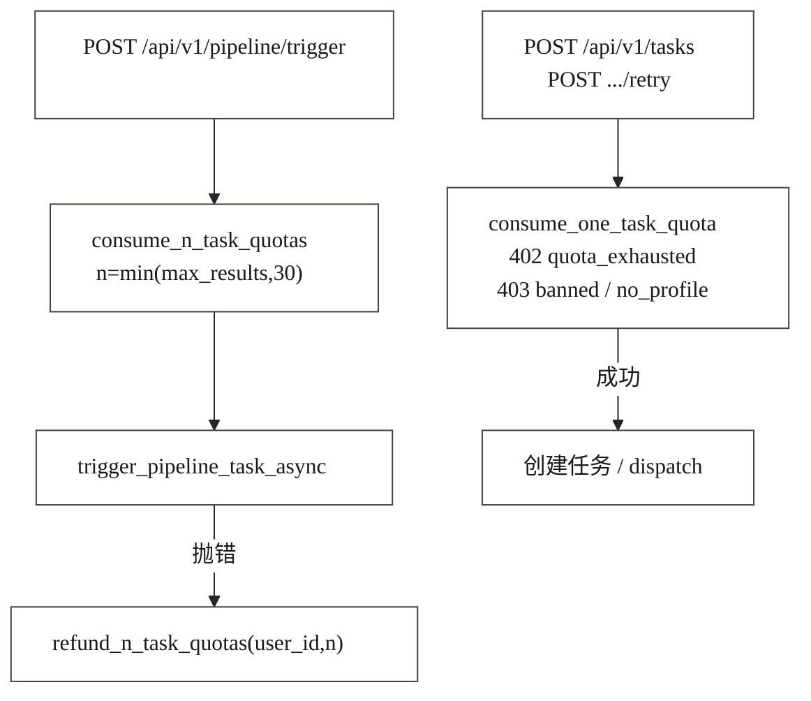
```mermaid
%%{init: {'theme':'base','themeVariables':{'fontFamily':'ui-sans-serif,system-ui,sans-serif','fontSize':'16px','primaryColor':'#fafaf9','primaryTextColor':'#1c1917','primaryBorderColor':'#44403c','secondaryColor':'#f5f5f4','tertiaryColor':'#e7e5e4','lineColor':'#27272a','secondaryTextColor':'#1c1917','tertiaryTextColor':'#292524','mainBkg':'#ffffff','textColor':'#1c1917','nodeBorder':'#44403c','defaultLinkColor':'#27272a','clusterBkg':'#ffffff','clusterBorder':'#a8a29e','edgeLabelBackground':'#ffffff','titleColor':'#0c0a09','actorBkg':'#fafaf9','actorBorder':'#44403c','actorTextColor':'#1c1917','signalColor':'#27272a','signalTextColor':'#1c1917','activationBkgColor':'#e7e5e4','activationBorderColor':'#57534e','noteBkgColor':'#fef9c3','noteTextColor':'#422006','noteBorderColor':'#a16207'}}}%%
flowchart TD
    CT["POST /api/v1/tasks\nPOST .../retry"] --> C1["consume_one_task_quota\n402 quota_exhausted\n403 banned / no_profile"]
    PT["POST /api/v1/pipeline/trigger"] --> Cn["consume_n_task_quotas\nn=min(max_results,30)"]
    Cn --> DIS["trigger_pipeline_task_async"]
    DIS -->|抛错| RF["refund_n_task_quotas(user_id,n)"]
    C1 -->|成功| TSK["创建任务 / dispatch"]
```


`AUTH_DISABLED=true` 时跳过 RPC（仅本地调试）。

---

## 16. 任务 API 一览（与前端 taskStore 对齐）

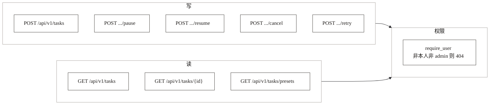
```mermaid
%%{init: {'theme':'base','themeVariables':{'fontFamily':'ui-sans-serif,system-ui,sans-serif','fontSize':'16px','primaryColor':'#fafaf9','primaryTextColor':'#1c1917','primaryBorderColor':'#44403c','secondaryColor':'#f5f5f4','tertiaryColor':'#e7e5e4','lineColor':'#27272a','secondaryTextColor':'#1c1917','tertiaryTextColor':'#292524','mainBkg':'#ffffff','textColor':'#1c1917','nodeBorder':'#44403c','defaultLinkColor':'#27272a','clusterBkg':'#ffffff','clusterBorder':'#a8a29e','edgeLabelBackground':'#ffffff','titleColor':'#0c0a09','actorBkg':'#fafaf9','actorBorder':'#44403c','actorTextColor':'#1c1917','signalColor':'#27272a','signalTextColor':'#1c1917','activationBkgColor':'#e7e5e4','activationBorderColor':'#57534e','noteBkgColor':'#fef9c3','noteTextColor':'#422006','noteBorderColor':'#a16207'}}}%%
flowchart LR
    subgraph Write["写"]
        P1["POST /api/v1/tasks"]
        P2["POST .../pause"]
        P3["POST .../resume"]
        P4["POST .../cancel"]
        P5["POST .../retry"]
    end

    subgraph Read["读"]
        G1["GET /api/v1/tasks"]
        G2["GET /api/v1/tasks/{id}"]
        G3["GET /api/v1/tasks/presets"]
    end

    subgraph ACL["权限"]
        R["require_user\n非本人非 admin 则 404"]
    end

    Write --> ACL
    Read --> ACL
```


---

## 17. 图与论文只读 API（节选）

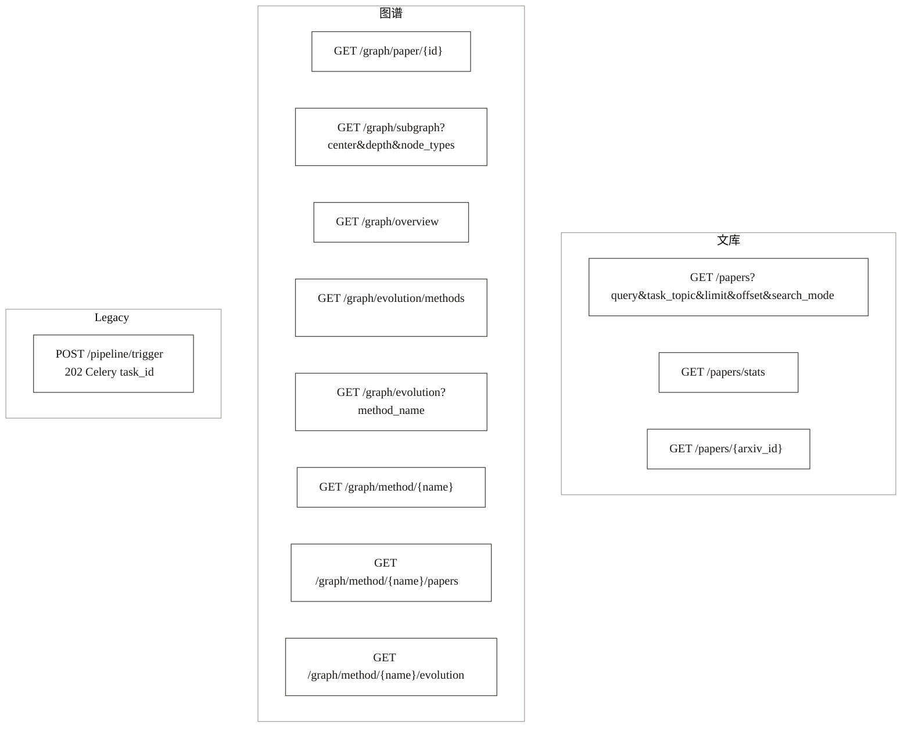
```mermaid
%%{init: {'theme':'base','themeVariables':{'fontFamily':'ui-sans-serif,system-ui,sans-serif','fontSize':'16px','primaryColor':'#fafaf9','primaryTextColor':'#1c1917','primaryBorderColor':'#44403c','secondaryColor':'#f5f5f4','tertiaryColor':'#e7e5e4','lineColor':'#27272a','secondaryTextColor':'#1c1917','tertiaryTextColor':'#292524','mainBkg':'#ffffff','textColor':'#1c1917','nodeBorder':'#44403c','defaultLinkColor':'#27272a','clusterBkg':'#ffffff','clusterBorder':'#a8a29e','edgeLabelBackground':'#ffffff','titleColor':'#0c0a09','actorBkg':'#fafaf9','actorBorder':'#44403c','actorTextColor':'#1c1917','signalColor':'#27272a','signalTextColor':'#1c1917','activationBkgColor':'#e7e5e4','activationBorderColor':'#57534e','noteBkgColor':'#fef9c3','noteTextColor':'#422006','noteBorderColor':'#a16207'}}}%%
flowchart TB
    subgraph PaperLib["文库"]
        A1["GET /papers?query&task_topic&limit&offset&search_mode"]
        A2["GET /papers/stats"]
        A3["GET /papers/{arxiv_id}"]
    end

    subgraph GraphRO["图谱"]
        B1["GET /graph/paper/{id}"]
        B2["GET /graph/subgraph?center&depth&node_types"]
        B3["GET /graph/overview"]
        B4["GET /graph/evolution/methods"]
        B5["GET /graph/evolution?method_name"]
        B6["GET /graph/method/{name}"]
        B7["GET /graph/method/{name}/papers"]
        B8["GET /graph/method/{name}/evolution"]
    end

    subgraph Legacy["Legacy"]
        L1["POST /pipeline/trigger\n202 Celery task_id"]
    end
```


---

## 18. 管理端 API（admin_routes.py）


| 方法    | 路径                         | 说明                                      |
| ----- | -------------------------- | --------------------------------------- |
| GET   | `/api/v1/admin/users`      | GoTrue + profiles 合并列表                  |
| POST  | `/users/{id}/ban` `/unban` | 封禁                                      |
| POST  | `/users/{id}/refill-quota` | 配额充值                                    |
| GET   | `/system-settings`         | `triage_threshold` `html_first_enabled` |
| PATCH | `/system-settings`         | 同上                                      |
| GET   | `/system-status`           | Neo4j/Redis/队列粗指标                       |
| POST  | `/clear-all-data`          | body `confirm: DELETE_ALL` + token      |
| POST  | `/heal-graph`              | 图谱自愈                                    |
| GET   | `/export-graph`            | JSON 快照                                 |
| POST  | `/import-graph`            | merge / replace                         |


依赖 `**require_admin**`：JWT `role=admin` 或 `X-ArxPrism-Admin-Token` 与 `ADMIN_RESET_TOKEN` 一致（见代码）。

---

## 19. 前端页面 ↔ 主要 API

**用户先怎么走页面**：见文首 **「用户视角动线」**；本节强调各页对应的 `lib/api/client` 封装。

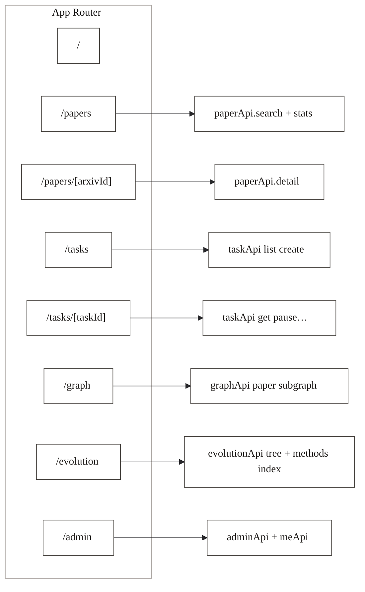
```mermaid
%%{init: {'theme':'base','themeVariables':{'fontFamily':'ui-sans-serif,system-ui,sans-serif','fontSize':'16px','primaryColor':'#fafaf9','primaryTextColor':'#1c1917','primaryBorderColor':'#44403c','secondaryColor':'#f5f5f4','tertiaryColor':'#e7e5e4','lineColor':'#27272a','secondaryTextColor':'#1c1917','tertiaryTextColor':'#292524','mainBkg':'#ffffff','textColor':'#1c1917','nodeBorder':'#44403c','defaultLinkColor':'#27272a','clusterBkg':'#ffffff','clusterBorder':'#a8a29e','edgeLabelBackground':'#ffffff','titleColor':'#0c0a09','actorBkg':'#fafaf9','actorBorder':'#44403c','actorTextColor':'#1c1917','signalColor':'#27272a','signalTextColor':'#1c1917','activationBkgColor':'#e7e5e4','activationBorderColor':'#57534e','noteBkgColor':'#fef9c3','noteTextColor':'#422006','noteBorderColor':'#a16207'}}}%%
flowchart LR
    subgraph Pages["App Router"]
        H["/"]
        PL["/papers"]
        PD["/papers/[arxivId]"]
        TL["/tasks"]
        TD["/tasks/[taskId]"]
        GR["/graph"]
        EV["/evolution"]
        ADM["/admin"]
    end

    PL --> A1["paperApi.search + stats"]
    PD --> A3["paperApi.detail"]
    TL --> T1["taskApi list create"]
    TD --> T2["taskApi get pause…"]
    GR --> G1["graphApi paper subgraph"]
    EV --> E1["evolutionApi tree + methods index"]
    ADM --> M1["adminApi + meApi"]
```


---

## 20. LLM 配置面（环境变量）

```mermaid
%%{init: {'theme':'base','themeVariables':{'fontFamily':'ui-sans-serif,system-ui,sans-serif','fontSize':'16px','primaryColor':'#fafaf9','primaryTextColor':'#1c1917','primaryBorderColor':'#44403c','secondaryColor':'#f5f5f4','tertiaryColor':'#e7e5e4','lineColor':'#27272a','secondaryTextColor':'#1c1917','tertiaryTextColor':'#292524','mainBkg':'#ffffff','textColor':'#1c1917','nodeBorder':'#44403c','defaultLinkColor':'#27272a','clusterBkg':'#ffffff','clusterBorder':'#a8a29e','edgeLabelBackground':'#ffffff','titleColor':'#0c0a09','actorBkg':'#fafaf9','actorBorder':'#44403c','actorTextColor':'#1c1917','signalColor':'#27272a','signalTextColor':'#1c1917','activationBkgColor':'#e7e5e4','activationBorderColor':'#57534e','noteBkgColor':'#fef9c3','noteTextColor':'#422006','noteBorderColor':'#a16207'}}}%%
flowchart LR
    subgraph Chat["Chat 多模型"]
        T["LLM_TRIAGE_MODEL"]
        X["LLM_EXTRACTOR_MODEL"]
        R["LLM_RESOLUTION_MODEL"]
    end

    subgraph Conn["连接"]
        B["LLM_BASE_URL + LLM_API_KEY"]
        EB["LLM_EMBEDDING_BASE_URL 可选\n绕开网关 CSRF"]
        EK["LLM_EMBEDDING_API_KEY 空则复用 KEY"]
    end

    subgraph Tunable["调参"]
        MT["LLM_MAX_TOKENS"]
        TMP["LLM_TEMPERATURE"]
        RET["LLM_MAX_RETRIES + BASE_DELAY"]
    end

    Conn --> Chat
    Conn --> EM["LLM_EMBEDDING_MODEL"]
```


---

## 21. Celery 与进程内回退

```mermaid
%%{init: {'theme':'base','themeVariables':{'fontFamily':'ui-sans-serif,system-ui,sans-serif','fontSize':'16px','primaryColor':'#fafaf9','primaryTextColor':'#1c1917','primaryBorderColor':'#44403c','secondaryColor':'#f5f5f4','tertiaryColor':'#e7e5e4','lineColor':'#27272a','secondaryTextColor':'#1c1917','tertiaryTextColor':'#292524','mainBkg':'#ffffff','textColor':'#1c1917','nodeBorder':'#44403c','defaultLinkColor':'#27272a','clusterBkg':'#ffffff','clusterBorder':'#a8a29e','edgeLabelBackground':'#ffffff','titleColor':'#0c0a09','actorBkg':'#fafaf9','actorBorder':'#44403c','actorTextColor':'#1c1917','signalColor':'#27272a','signalTextColor':'#1c1917','activationBkgColor':'#e7e5e4','activationBorderColor':'#57534e','noteBkgColor':'#fef9c3','noteTextColor':'#422006','noteBorderColor':'#a16207'}}}%%
flowchart TD
    R["Redis ping 失败?"] -->|是| SYNC["get_celery_app → None"]
    R -->|否| CEL["celery 实例 broker=redis_url"]

    DIS["task_routes._dispatch_task_execution"] --> CEL
    DIS -->|None| ASY["asyncio.create_task\nexecute_task_pipeline_async\n同进程跑流水线"]

    CEL --> WK["Worker 进程\n全局 event loop\n_run_async(coro)"]
```


Worker 配置摘录：`task_soft_time_limit=500`、`task_time_limit=600`、`worker_prefetch_multiplier=1`、`task_acks_late=True`。

---

## 22. 实体归一化（防线 2，`_normalize_name`）

```mermaid
%%{init: {'theme':'base','themeVariables':{'fontFamily':'ui-sans-serif,system-ui,sans-serif','fontSize':'16px','primaryColor':'#fafaf9','primaryTextColor':'#1c1917','primaryBorderColor':'#44403c','secondaryColor':'#f5f5f4','tertiaryColor':'#e7e5e4','lineColor':'#27272a','secondaryTextColor':'#1c1917','tertiaryTextColor':'#292524','mainBkg':'#ffffff','textColor':'#1c1917','nodeBorder':'#44403c','defaultLinkColor':'#27272a','clusterBkg':'#ffffff','clusterBorder':'#a8a29e','edgeLabelBackground':'#ffffff','titleColor':'#0c0a09','actorBkg':'#fafaf9','actorBorder':'#44403c','actorTextColor':'#1c1917','signalColor':'#27272a','signalTextColor':'#1c1917','activationBkgColor':'#e7e5e4','activationBorderColor':'#57534e','noteBkgColor':'#fef9c3','noteTextColor':'#422006','noteBorderColor':'#a16207'}}}%%
flowchart TD
    S["原始方法名字符串"] --> L["lower trim"]
    L --> X["正则去尾词\nmodel framework algorithm …"]
    X --> R["非字母数字 → 连字符\n合并重复 -"]
    R --> T["trim 连字符"]
    T --> K["Method MERGE 键 name"]
```


LLM `**EntityResolutionResponse**` 聚类在流水线/管理端 heal 中用于**同义合并**（具体调用路径以 `neo4j_client` 与 admin `heal-graph` 为准）。

---

## 维护说明

1. **图模型**、**Redis 键**、**API 路径**、**阈值常量** 以代码为准；改代码请同步改本节对应图或表格。
2. `ARCHITECTURE.md` 若与 `**EVOLVED_FROM` 进化树**、**Metric 节点** 等描述冲突，以 `**neo4j_client._REL_TYPES`** 与本文为准。

